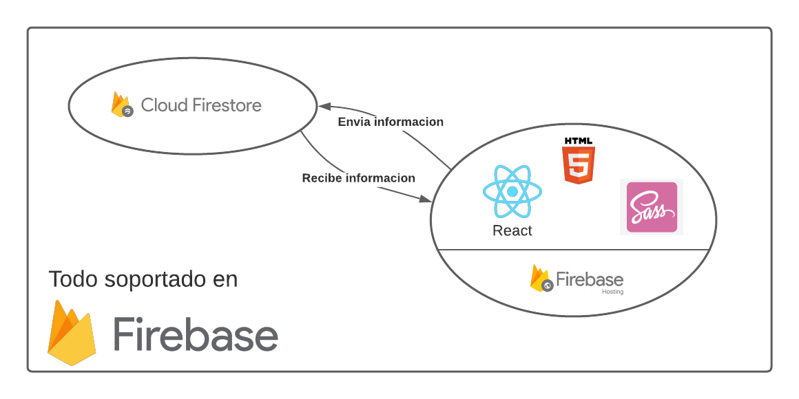

# Frases - firebase
 
Este proyecto consiste en ingresar frases y guardarlas en la base de datos de google, firestore
 
## Cómo funciona
 
Una vez entras en la aplicación se trae los datos de firestore y esta se queda escuchando a nuevos cambios. Es por ello que se pueden ver actualizaciones en vivo. Un diagrama del funcionamiento sería:
 

 
## ¿Cuál es el propósito?
 
Aprender y divertirse!, agregar una frase no tiene ninguna utilidad pero si varias personas ingresan algo, puede ser interesante ver el resultado, la aplicación actualmente se está viendo así:
 

 
 
## ¿Cómo puedo aportar?
 
Agregando una frase al proyecto!.
Puedes ingresar a la aplicacion con este enlace: [frases.santiagorincon.site](https://frases.santiagorincon.site/)
